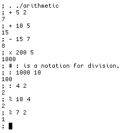
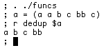
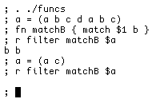
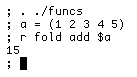
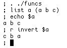
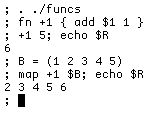

# rc-tricks
Some snippets of code written in Plan 9's rc shell.

### Arithmetic

### Functional Programming
All functions in the `funcs` file, other than `buf`, `set` and `r` store the result of their operation in the variable `$R`. These functions are intended to provide similar functionality to that available in functional programming languages such as Haskell, OCaml and Lisp.

`dedup` removes all duplication elements from an array.

`r` outputs the return value(`$R`) of a function.

`match` compares two strings and returns `true` if they're the same.

`filter` runs a function on every element in an array, and returns the element if it returns true.

`fold` combines an array into a single element via a function.

`list` declares an array.

`invert` reverses an array.

`map` runs a function on every element in an array, and returns the result.

### Use
Use a file's functions in a 'namespace'!

![Use demonstration(img/use.png)
